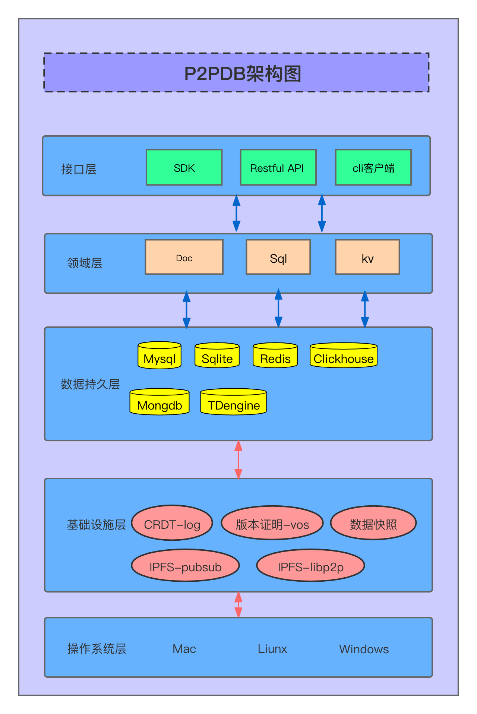

# P2PDB

[](https://github.com/RichardLitt/standard-readme)

中文 | [English](./README-en.md)

##### 注意：
本项目只作为新型数据库技术理论验证使用，当前不具备任何生产可用性。

##### 简介
P2PDB（p2p数据库），一个去中心化、分布式、点对点数据库、P2PDB使用IPFS-libp2p构建分布式网络和IPFS-pubsub与对等节点同步数据。P2PDB期望打造一个去中心化的分布式数据库，使P2PDB 成为线下实体店离线应用程序，去中心化应用程序(dApps)、和边缘计算应用数据存储的绝佳选择, P2PDB基于[白皮书](doc/zh-CN/%E7%99%BD%E7%9A%AE%E4%B9%A6.md)实现

P2PDB包含以下功能：

1. `count` 一个分布式计数器，用于验证项目可行性，使用CRDT协议，实现最终一致性（开发中）

2. `kv`   一个key=>value 的键值数据库，使用CRDT协议，实现最终一致性（已完成）

3. `doc`  一个专为配置文档、注册中心设计的文档数据库，使用CRDT协议，实现最终一致性（探索中，未有明确计划）

4. `sql`   一个基于sqlite,  使用CRDT协议，实现最终一致性（开发中）

5. `log`   基于CRDT协议协议实现的不可篡改日志组件，用于保险、智能汽车、交易凭证等需要保证一旦生成就不可逆的日志场景(开发中）

6. `pubsub` 基于IPFS Pubsub实现 消息订阅、广播推送  （探索中，未有明确计划）

## 内容列表

- [背景](#背景)
- [目标](#目标)
	- [使用场景](#使用场景)
- [架构](#架构)
	- [目录分层](#目录分层)
- [使用说明](#使用说明)
	- [安装](#安装)
	- [文档](#理解CDRT协议)
- [徽章](#徽章)
- [示例](#示例)
- [相关仓库](#相关仓库)
- [维护者](#维护者)
- [如何贡献](#如何贡献)
- [使用许可](#使用许可)

## 背景
P2PDB最早源于KK集团离线收银项目的研发，早期采用了Raft协议+Sqlite 实现一个轻量级的分布式数据库，随着对Raft协议的深入研究，发现Raft协议对于离线场景存在较大缺陷（故障节点数量大于50%，整个集群无法工作）,随后开启了深入研究分布式数据库协议的道路,在一年后发现基于默克尔有向无环图+CRDT实现的逻辑时钟可以实现最终一致性的去中心化、分布式、点对点数据库，并且针对离线场景做了充分的支持。


P2PDB 是一个点对点数据库，这意味着每个对等点都有自己的特定数据库实例。数据库在对等点之间自动复制，从而在任何对等点更新时生成数据库的最新视图。也就是说，数据库被拉到客户端。

这意味着每个应用程序都包含他们正在使用的完整数据库。与客户端-服务器模型相比，这反过来又改变了数据建模，客户端-服务器模型通常为所有数据使用一个大数据库：在 P2PDB 中，应该根据该数据的访问权限进行存储、“分区”或“分片”。例如，在类似微博的应用程序中，推文不会保存在数百万用户同时写入的全局“推文”数据库中，而是每个用户都有自己的微博数据库。要订阅别的用户推文，只需关注主题（topic）


—— [跟ipfs的关系](https://www.ipfs.io/)    

> ipfs协议 用于构建分布式低延迟的消息传输网络，而P2PDB 项目是基于ipfs协议实现.。

<!-- —— [跟filecoin的区别](https://filecoin.io/)
> P2PDB类似filecoin实现文件交换网络一样，目的是为了实现全球去中心化的数据交换网络。不同的是， P2PDB只接受一段数据流的存储而不是文件，相对filecoin来说，P2PDB更轻量级，数据交换速度更快（数据体积更小），P2PDB可以理解为是一款边缘存储的轻量级关系型数据库，当然P2PDB也支持非关系性数据库中key=>value 键值对，以及类似mongdb的文档型数据存储格式。 -->


## 目标
 这个数据库的目标是：

1. 一个**Dapp应用数据存储方案**
2. 一个**去中心化分布式数据库解决方案**
3. 一个**边缘数据存储解决方案**

 使用场景
* 1、文章阅读数、投票数、点赞数
* 2、文章评论
* 3、微服务的服务注册、发现
* 4、配置中心
* 5、分布式缓存
* 6、多人实时协作
* 7、更多.........

## 架构

#### 架构设计图

#### 目录分层设计
```
interface 接口层
----api
--------count
--------kv
--------doc
--------sql
-----http 对外暴露的http api 接口
-----rpc 对外暴露的rpc api接口
-----cli 命令行执行工具
domain 领域层， 核心逻辑
Infrastructure	基础设施层
----ipfs
--------ipfs-log
----sqlite
----Util  公共工具，如日志
--------log
```

<!-- 
##安装

这个项目使用 [golang](hhttps://golang.org) 请确保你本地安装了它。


初始化项目
```sh
go mod tidy
```

编译kv数据库
```sh
go build ./interface/cli/kv/kv.go
```

使用
```sh
./kv
```
## 示例

```go
Commands:

> list               -> list items in the store
> get <key>          -> get value for a key
> put <key> <value>  -> store value on a key
> exit               -> quit
``` -->


## 文档
- [文档](https://github.com/kkguan/p2pdb/tree/main/doc)


想了解我们建议的规范是如何被应用的，请参考 [example-readmes](example-readmes/)。


## 本数据库使用到的部分仓库

- [libp2p](https://github.com/libp2p/go-libp2p) 
- [ipfs](https://github.com/ipfs/go-ipfs)

## 维护者

[@Rock](https://github.com/Rock-liyi)

## 如何贡献

非常欢迎你的加入！[提一个 Issue](https://github.com/Rock-liyi/ptwopdb) 或者提交一个 Pull Request。


标准 Readme 遵循 [Contributor Covenant](http://contributor-covenant.org/version/1/3/0/) 行为规范。

### 贡献者
© Rock Li
<!-- 感谢以下参与项目的人：
<a href="graphs/contributors"></a> -->


## 使用许可

Apache License Version 2.0 see http://www.apache.org/licenses/LICENSE-2.0.html


